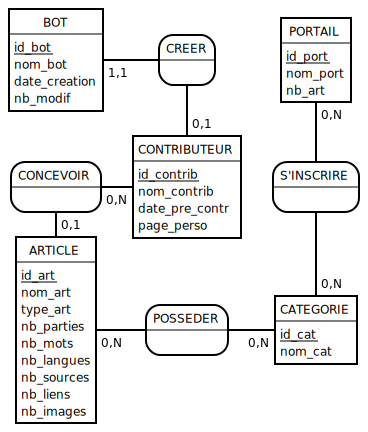

# Wikistats.py
CHOPIN Johann
HENRY Justin
GUIDOUX Alexandre

----------

## Sommaire

###   I. Présentation
###  II. Modèle Conceptuel de données
### III. Dictionnaire de données et lexique
###  IV. Tables
###   V. Requêtes SQL
###  VI. Formulaire
### VII. Conclusion

-----------

## I. Présentation

> L'information, c'est le pouvoir ...
... et c'est pourquoi notre objectif est d'amasser un grand nombre de données, d'avoir quelque chose d'exploitable. Nous aimons programmer en python et la plus grande source de données est le web ; il est tout désigné. Mais quelles informations y extraire ? Nous ciblons un seul site : Wikipédia ; les informations y sont bien organisées et faciles d'accès. Faire un projet pour faire un projet n’a pas vraiment de sens, il faut que ce soit utile et amusant. Notre projet essaye de répondre
à ces questions : qu’est-ce qui distingue les articles de qualité et les bons articles, des articles normaux sur Wikipédia ?

## II. Modèle Conceptuel de données

L’article est l’élément primordial de Wikipédia. C’est à partir de cette entité que l’on peut extraire le plus de données. On recherche ensuite les entités liées ; on obtient les catégories, les liens, les contributeurs ; puis les bots et les portails. Cela fait déjà un assez grand volume de
données à récupérer et à traiter. Toutes ces données nous renvoient au final ce MCD :

## Dictionnaire des données et lexique:

>ARTICLE ( #id_article, nom_article, type_art, nb_parties, nb_mots, nb_langues, nb_sources, nb_liens, nb_images )  
CONTRIBUTEUR ( #id_contrib, nom_contrib, date_pre_contr, page_perso)  
BOT ( #id_bot, nom_bot, date_creation, nb_modif, #id_contributeur )  
CATEGORIE ( #id_categorie, nom_cat )  
PORTAIL ( #id_portail, nom, nb_article )

La table **ARTICLE** est la table principale du MCD. Elle regroupe les statistiques d'un article. A savoir:
* son nom: `nom_art`
* son type (normal, article de qualité, bon article): `type_art`
* son nombre de parties dans le sommaire : `nb_parties`  
* le nombre de mots dont il est composé : `nb_mots`
* ses traductions dans d'autres langues (français compris) : `nb_langues`
* le nombre de sources auxquelles il fait référence : `nb_sources`
* le nombre de liens qu'il possède : `nb_liens`
* le nombre d'image affiché à l'écran : `nb_liens`

Un **article** est crée et écrit par un seul **CONTRIBUTEUR**, nous connaissons son *nom* (`nom_contrib`), sa *date de première contribution* (`date_pre_contr`) et si il possède une page de profil (`page_perso`)

Il peut arriver qu'un *contributeur* programme et soit responsable d'un **BOT**. Nous notons son nom (`id_bot`), sa date de création (`date_creation`), le nombre de modification effectuée par ce bot sur des articles de wikipédia (`nb_modif`) et son status d'activité (`statut`)

Un *article* possède aucun, une ou plusieurs **CATEGORIE**. Il y a donc son nom (`nom_cat`). Cette *catégorie* s'inscrit elle-même dans des **PORTAIL**. Nous avons aussi leur nom (`nom_port`) ainsi que le nombre d'*article* contenu dans le *portail* (`nb_art`).

Quelques contraintes techniques modifient les cardinalités :
* Nous n'avons pas tous les contributeurs, donc un article peut avoir aucun auteur.
* Toutes les catégories s'inscrivent dans des portails, mais parfois des catégories s'inscrivent dans des catégories qui elles ont un portail. Elle n'ont pas de portail liée dans ce cas.
* Toutes catégories à normalement des articles, mais nous n'avons pas tous les articles francophones. Certaines catégories peuvent donc posséder aucun article.